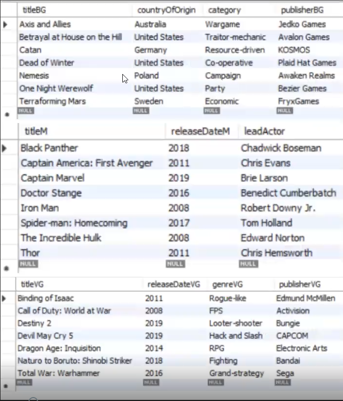
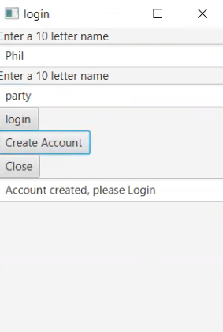
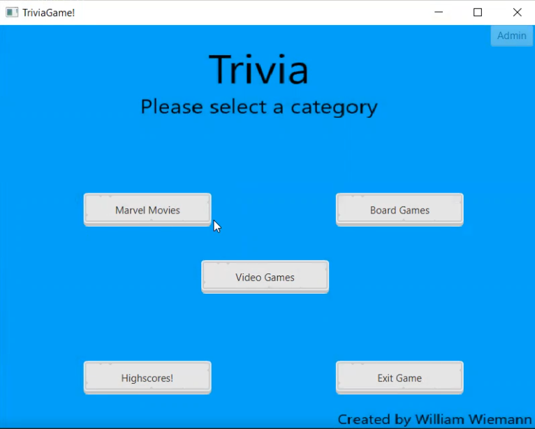
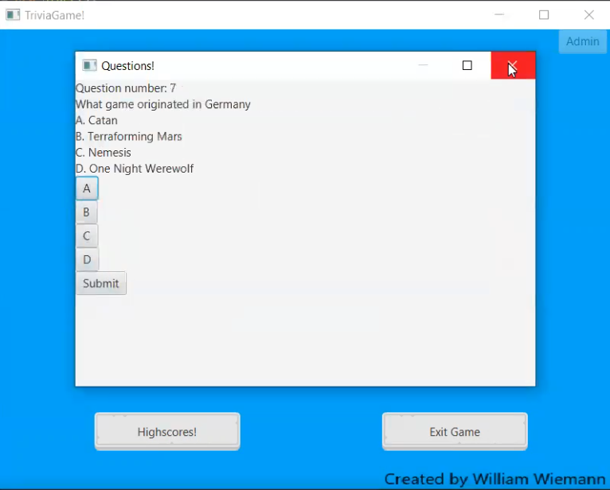
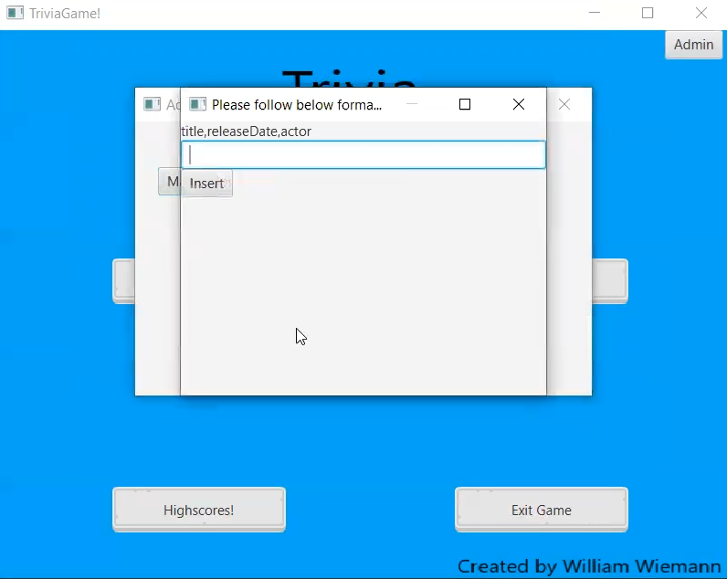

# JavaFX 1.8 Trivia game with MySQL database
Uploading older class assignment (Spring 2021)

This program was a final for a Files and Database class. The main purpose was to connect a database to a GUI and interact with it.

To do this, I created my MySQL database and populated the tables. I then created admins and users; so the admins would be able to add and remove content without having to access the database. With some logic, I populated questions based on the categories of each table.

  
    
    
    
    
    
  

